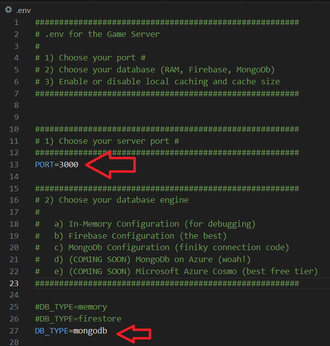

# SBA319 - Real-time Chat Lobby Application

A real-time chat lobby system built with Node.js, Express, and a
modular database system supporting both in-memory and Firebase
and MongoDB storage.

Upgrades from SBA318

1) About 20 database engine bugs fixed in the swappable database engine
2) MongoDB engine added (so now we have In-memory, Firebase, and MongoDb)
   (NOTE NO REGRESSION TESTING ON In-Memory yet)
3) Cache engine! There is a full cache engine that can be set in the .env.
   Turned off by default.  It works really well on top of Firestore.
   IT DOES NOT WORK ON MONGODB yet. 
4) Settings page with seperate tabs
5) Initialize MongoDB database (only MongoDB) through a route
   localhost:3000/admin/createdb
6) Tons of userID handling fixes (and it needs more)
7) Discovered a huge bug in the custom middleware bug I used in SBA318 and
   decided it wasn't worth keeping.

## .ENV file

Make sure you have PORT and DB_TYPE and MONGODB_URI and
ENABLE_CACHE set correctly!

If you are grading my homework, and can't get the .env to work right, just
text me (408) 406-1832.  It's my biz and personal phone #... it's all over
the internet, I have a business, I get 40-80 client texts on a busy day.

## Launching the app:

nodemon dev

## Launching the client:

localhost:3000

Note: You can launch multiple clients in different browser tabs and
talk to each other.  It works!

## Testing

1. Register user, create game, and send chat message does a POST on
   the user collection

2. Delete game does a DELETE from the game collection

3. Delete user from the settings page DOES NOT do a DELETE
   (intentionally). It does a soft delete on purpose cause relations
   would break (I also learned big game servers dont do a hard
   delete either).

4. Chats in the game room and lobby use GETS with different query parms
   criteria so it's already tested.

5. Updating your password in the settings -> account page does a PATCH

6. Updating your nickanme in the settings -> profile page does a PATCH

7. Index is created when you initialize the database at /admin/createdb

8. Sensible data validation is on the user collection.  Nickname uses
   some hardcore validation logic and can be seen in the compass
   validation page.

# History

The code for SBA319 was originally from SBA318 which was my
over-ambitious and abandoned sba316 chat / game lobby code I was
trying to get to work and I couldn't.

But now SBA319 is what I wanted SBA318 to be which was what I
wanted SBA316 to be, and even tho it's got a few weird bugs and
stability issues, when it works it looks amazing!

# Creating the initial database

1) Start the server (nodemon dev)

2) in your browser go to URL:
    localhost:3000/admin/createdb

    

3) launch one or more browser tabs for each client:
    localhost:3000

# Requirements

| Requirement | Weight | Finished |
| :-- | :--: | :--: |
| Use at least three different data collections within the database (such as users, posts, or comments). | 5% | ✅ |
| Utilize reasonable data modeling practices. | 10% | ✅ |
| Create GET routes for all data that should be exposed to the client, using appropriate query commands to retrieve the data from the database. | 10% | ✅ |
| Create POST routes for data, as appropriate, using appropriate insertion commands to add data to the database. At least one data collection should allow for client creation via a POST request. | 10% | ✅ |
| Create PATCH or PUT routes for data, as appropriate, using appropriate update commands to change data in the database. At least one data collection should allow for client manipulation via a PATCH or PUT request. | 10% | ✅ |
| Create DELETE routes for data, as appropriate, using appropriate delete commands to remove data from the database. At least one data collection should allow for client deletion via a DELETE request. | 10% | ✅ |
| Include sensible indexes for any and all fields that are queried frequently. For fields that may have a high write-to-read ratio, you may forgo indexes for performance considerations. Make comments of this where applicable. | 5% | ✅ |
| Include sensible MongoDB data validation rules for at least one data collection.    Note: this may be accomplished in a number of ways. If you choose to perform this task outside of your application's code, you must include a way to test the validation within the application's routes. This can be as simple as providing a POST route that attempts to create an invalid document and displays the resulting error. | 5% | ✅ |
| Populate your application's collections with sample data illustrating the use case of the collections. You must include at least five sample documents per collection.    Note: Double-check this requirement before submission. Testing your delete routes may leave you under the requirement. To be safe, populate your collections with sample data well above the requirement (we recommend 10-20 documents). | 5% | ✅ |
| Utilize reasonable code organization practices. | 5% | ✅ |
| Ensure that the program runs without errors (comment out things that do not work, and explain your blockers - you can still receive partial credit). | 10% | ✅ |
| Commit frequently to the git repository. | 5% | ✅ |
| Include a README file that contains a description of your application.    This README must include a description of your API's available routes and their corresponding CRUD operations for reference. | 2% | ✅ |
| Level of effort displayed in creativity, presentation, and user experience. | 5% | ✅ |
| Use Mongoose to implement your application.    Note: The validation requirements above must still be implemented database-side, but should also be implemented application-side within your Mongoose schema(s). | +1% | NO |

## There are 3 paths in the main API to meet the requirements:

- The API is RESTFUL... the documentation can be found in api-reference.txt.  It's mostly
correct.  Real quick:

/users
-- This endpoint creates users (POST), updates users info (PATCH), queries users (GET)
login (POST), logout (POST)

/lobby
-- This endpoint lets you create (POST) and fetch (GET) chatrooms/enter chatrooms/leave chatrooms

/chat
-- This endpoint fetches chat data for a user or for the lobby

The full details of all the routes are in api-reference.txt

## Accessing the EJS page

I ran out of time and didn't build a full "page" for the EJS part of the requirements.  I serve
it through a link on the login window, but it's not part of the UI flow.  The UI is amazing
but is mostly meaningless for a chat app.  Make sure to open a few other
windows and connect to the chat server before launching the EJS page.

## STUFF THAT IS BROKEN

- If the server is not running, index.html breaks badly.
- Email support
- If the server runs too long, the server or the client crashes, idk why
- All the code is super fragile. Small changes and everything falls apart.
- I started adding slash commands to the chat (/ignore /help etc), but like
  everything else I do, I was too ambitious and it doesn't work.
  The testplan.txt is generated by Gemini from screenshots and is lame.
  The api-reference.txt is also generated by Gemini and is out of date.
  There might be a few window.alerts that are still active
  Logout button doesn't always work
  The dashboard EJS loses data on the SEE refresh.  I didn't have time to fix it.
  So it's correct for like a second.

## Features

- User authentication (register/login)
- Real-time lobby
- Create and join chat rooms with player limits
- Nickname support for players
- Modular database system (in-memory or Firestore or MongoDB)
- Security features (sorta, it's middleware and if you run the server too long it disconects)

## Chat Room Features

- Create rooms with customizable player limits (1-4 players)
- Join/leave chat rooms
- Real-time player list updates
- Nickname display for all players
- You can password protect a room

## Database System

The application uses a modular database system that supports:
- In-memory storage (development)
- MongoDB (works I think!)
- Extensible for other database types

To add a new database engine:
1. Create new engine file in `database/`
2. Extend `BaseDbEngine`
3. Implement required methods
4. Add to `selectDbEngine.js`
5. Update DB_TYPE in `.env`

# The UI Style Sheets From Hell

SBA308a (my cat project) I did all the CSS myself and it took
almost about 5 days to get right and it was only like 80% of what
I wanted. My mentor says nobody does CSS style sheets by hand
anymore cause it's not a good use of time.

So for SBA318 I decided I was NOT going to style every single border
and color in this beautiful UI by hand.  I fed my index.html and my
dashboard.ejs into a CSS builder and described what I wanted and blam,
out came an amazing stylesheet.

Except it wasn't so simple.  It took almost 3 days to get the UI to
look as awesome as it was. Natural language CSS builders don't
work out of the box.  What it gets right looks amazing... what it
doesn't get right.. well... makes it impossible to debug. CSS builders
don't spit out comments and have so many weird bugs with scroll bars, 
etc., in the CSS I had to just go back to an older verison and try again.
