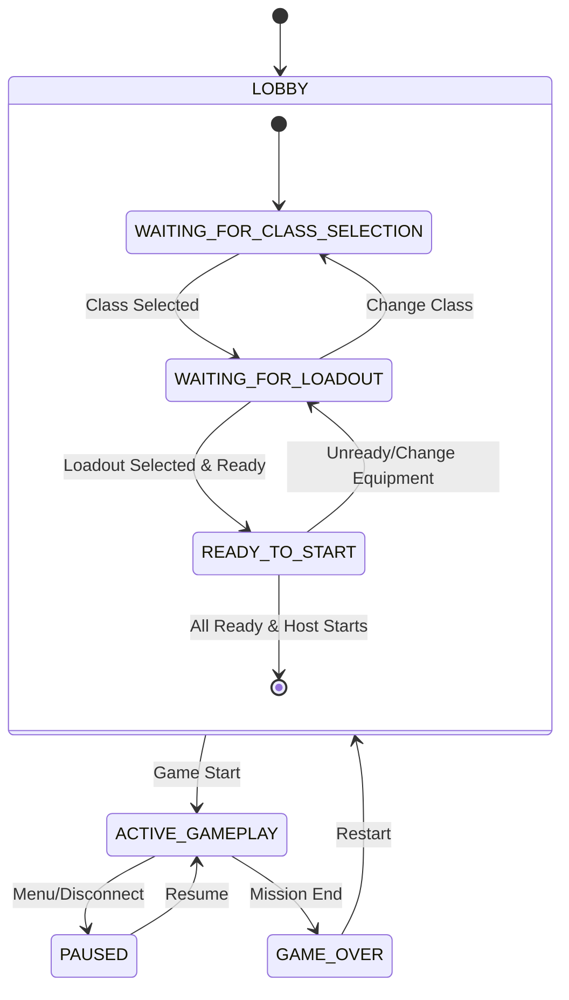
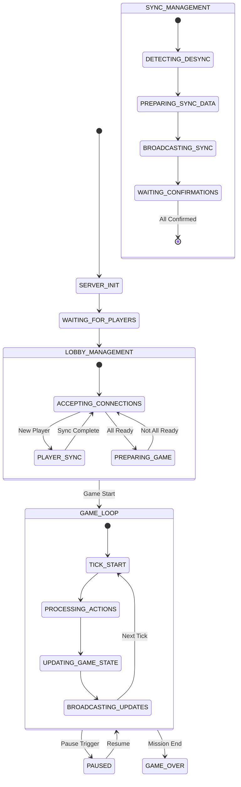
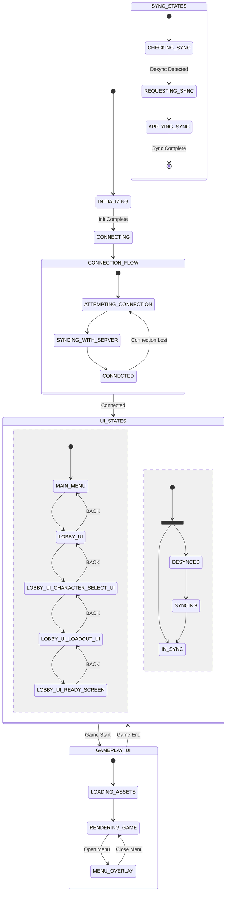
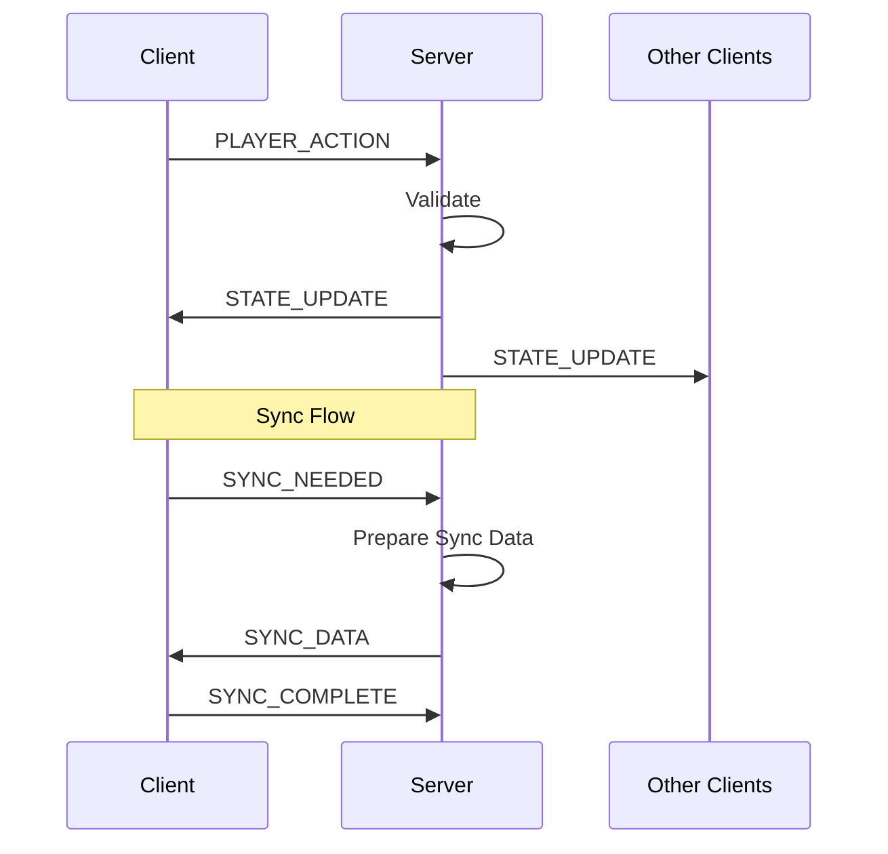

# Net40K State Machine Documentation

## Overview

Net40K uses three distinct but interconnected state machines:
1. Logical Game State - The conceptual game state
2. Server State Machine - The authoritative implementation
3. Client State Machine - The local player view

## 1. Logical Game State

This represents the conceptual state of the game, independent of implementation.



## 2. Server State Machine

The authoritative implementation that manages all player states.



## 3. Client State Machine

The local player's view of the game, including UI states.



## Detailed State Descriptions

### 1. Logical Game States

#### LOBBY States
- `WAITING_FOR_CLASS_SELECTION`: Initial player setup phase
- `WAITING_FOR_LOADOUT`: Equipment and loadout selection phase
- `READY_TO_START`: Pre-game preparation complete

#### Gameplay States
- `ACTIVE_GAMEPLAY`: Main game loop with 500ms ticks
- `PAUSED`: Game temporarily halted
- `GAME_OVER`: Mission completed or failed

### 2. Server States

#### Initialization
- `SERVER_INIT`: Server startup and resource allocation
- `WAITING_FOR_PLAYERS`: Server ready to accept connections

#### Lobby Management
- `ACCEPTING_CONNECTIONS`: Processing new player connections
- `PLAYER_SYNC`: Synchronizing state with new/returning players
- `PREPARING_GAME`: Validating all players ready, preparing game start

#### Game Loop
- `TICK_START`: Beginning of 500ms game tick
- `PROCESSING_ACTIONS`: Handling queued player actions
- `UPDATING_GAME_STATE`: Calculating new game state
- `BROADCASTING_UPDATES`: Sending state changes to clients

#### Sync Management
- `DETECTING_DESYNC`: Monitoring client state consistency
- `PREPARING_SYNC_DATA`: Creating state update package
- `BROADCASTING_SYNC`: Sending sync data to clients
- `WAITING_CONFIRMATIONS`: Ensuring all clients synchronized

### 3. Client States

#### Startup
- `INITIALIZING`: Loading local resources
- `CONNECTING`: Establishing server connection

#### Connection Flow
- `ATTEMPTING_CONNECTION`: Trying to connect to server
- `SYNCING_WITH_SERVER`: Getting initial state
- `CONNECTED`: Active server connection

#### UI Flow
- `MAIN_MENU`: Initial game menu
- `LOBBY_UI`: Player/game setup interface
- `CHARACTER_SELECT_UI`: Class selection screen
- `LOADOUT_UI`: Equipment selection screen
- `READY_SCREEN`: Waiting for game start

#### Gameplay UI
- `LOADING_ASSETS`: Preparing game resources
- `RENDERING_GAME`: Active gameplay display
- `MENU_OVERLAY`: In-game menu system

#### Sync States
- `CHECKING_SYNC`: Verifying state match with server
- `REQUESTING_SYNC`: Asking for state update
- `APPLYING_SYNC`: Updating local state

## State Interactions

### Example: Player Opens Inventory
1. Client State: `RENDERING_GAME` -> `MENU_OVERLAY`
2. Logical State: `ACTIVE_GAMEPLAY` -> `PAUSED`
3. Server State: `GAME_LOOP` -> `PAUSED`
4. Server broadcasts pause
5. Other clients update accordingly

### Example: Game Start Sequence
1. All clients reach `READY_SCREEN`
2. Server validates in `PREPARING_GAME`
3. Server transitions to `GAME_LOOP`
4. Clients move to `LOADING_ASSETS`
5. When all ready, gameplay begins
## Message Flows

### Connection and Sync Messages
```javascript
// Client -> Server
CONNECT_REQUEST: { clientVersion: string }
SYNC_NEEDED: { lastGoodTimestamp: number }
SYNC_COMPLETE: { timestamp: number }

// Server -> Client
CONNECT_ACCEPTED: { serverVersion: string }
SYNC_DATA: { gameState: object, timestamp: number }
```

### Lobby Messages
```javascript
// Client -> Server
CLASS_SELECT: { classType: string }
LOADOUT_UPDATE: { equipment: object }
PLAYER_READY: { ready: boolean }

// Server -> Client
PLAYER_UPDATE: { id: number, changes: object }
GAME_STARTING: { countdown: number }
```

### Gameplay Messages
```javascript
// Client -> Server
PLAYER_ACTION: {
    type: string,
    data: object,
    timestamp: number
}

MENU_STATE: {
    menuType: string,
    isOpen: boolean
}

// Server -> Client
TICK_UPDATE: {
    tick: number,
    updates: array,
    timestamp: number
}

GAME_PAUSED: {
    reason: string,
    pausingPlayer: number
}
```

## Synchronization Types

### Lobby Synchronization
- Less time-critical
- Syncs:
  - Player states
  - Character selections
  - Equipment choices
  - Ready status
- Tolerant of minor delays

### Gameplay Synchronization
- Time-critical (500ms ticks)
- Syncs:
  - Player positions
  - Action points
  - Movement points
  - Combat state
  - Environmental state
- Requires precise timing
- May need state interpolation

## Message Flow Example



## State Data Structure

```javascript
GAME_STATE = {
    currentState: string,  // Current game state
    players: [
        {
            id: number,
            status: {
                connected: boolean,
                ready: boolean,
                currentMenu: string,
                syncState: {
                    isInSync: boolean,
                    lastSyncTime: timestamp,
                    needsFullSync: boolean,
                    pendingUpdates: number
                }
            },
            character: object,    // Character data
            gameplayState: object // Active gameplay data
        }
    ]
}
```
